## 📈 Cropping Stage Parameter Optimization Flow

This project followed a structured Design of Experiments (DOE) methodology to optimize the cropping process in a traditional IC packaging flow. The methodology is divided into four distinct stages, as outlined in the figure above:

```mermaid
flowchart LR
    %% === Nodes ===
    A1[Define Objective]
    A2[Select Parameters]

    B1[Fractional DOE]
    B2[Full DOE]
    B3[Response Surface Modeling]
    B4[Model Evaluation]

    C1[Robustness Testing]
    C2[Validation Experiment]

    D1[Final Spec]

    %% === Structure ===
    subgraph Preprocessing Stage
        A1 --> A2
    end

    subgraph Optimization Stage
        B1 --> B2 --> B3 --> B4
    end

    subgraph Validation Stage
        C1 --> C2
    end

    subgraph Finalization
        D1
    end

    A2 --> B1
    B4 --> C1
    C2 --> D1

    %% === Styling ===
    classDef preprocess fill:#d0ebff,stroke:#339af0,color:#000;
    classDef optimize fill:#e0f7fa,stroke:#00acc1,color:#000;
    classDef validate fill:#e6f4ea,stroke:#43a047,color:#000;
    classDef finalize fill:#fff3cd,stroke:#ffc107,color:#000;

    class A1,A2 preprocess;
    class B1,B2,B3,B4 optimize;
    class C1,C2 validate;
    class D1 finalize;
```

## 📐 Preprocessing Parameter Selection

    
| Category              | Parameter            | Type           | Unit | Example Levels                                                  |
|:---------------------:|:--------------------:|:--------------:|:----:|:-------------------------------:                                |
| Machine Parameter     | Blade Speed          | Control Factor | rpm  | 3000 4000 5000                                            |
| Machine Parameter     | Cutting Force        | Control Factor | N    | 20 25 30                                                  |
| Machine Parameter     | Cutting Angle        | Control Factor | °    | 0 15 30                                                   |
| Material Parameter    | Blade Material       | Control Factor | —    | High-Speed Steel (HSS) TiAlN-Coated Carbide                  |
| Material Parameter    | Tape Adhesion Type   | Control Factor | —    | Acrylic-Based Pressure-Sensitive Tape (PSA) UV Dicing Tape   |
| Material Parameter    | Leadframe Thickness  | Control Factor | mm   | 0.15 0.20                                                    |
| Environment Parameter | Ambient Humidity     | Noise Factor   | %RH  | 25–35 45–55 65–75                                         |
| Environment Parameter | Room Temperature     | Noise Factor   | °C   | 20 25 30                                                  |

