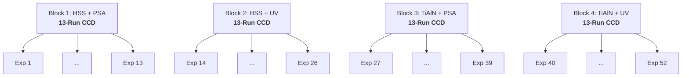

# 📈 Cropping Stage Parameter Optimization Flow

This project followed a structured Design of Experiments (DOE) methodology to optimize the cropping process in a traditional IC packaging flow. The methodology is divided into four distinct stages, as outlined in the figure above:

```mermaid
flowchart LR
    %% === Nodes ===
    A1[Define Objective]
    A2[Select Parameters]

    B1[Fractional DOE]
    B3[Response Surface Modeling]

    E1[Model Evaluation]

    C1[Robustness Testing]
    C2[Validation Experiment]

    D1[Final Spec]

    %% === Structure ===
    subgraph Preprocessing Stage
        A1 --> A2
    end

    subgraph Optimization Stage
        B1 --> B3
    end

    subgraph Model Evaluation
        E1
    end

    subgraph Validation Stage
        C1 --> C2
    end

    subgraph Finalization
        D1
    end

    A2 --> B1
    B3 --> E1
    E1 --> C1
    C2 --> D1

    %% === Styling ===
    classDef preprocess fill:#d0ebff,stroke:#339af0,color:#000;
    classDef optimize fill:#e0f7fa,stroke:#00acc1,color:#000;
    classDef evaluate fill:#ede7f6,stroke:#7e57c2,color:#000;
    classDef validate fill:#e6f4ea,stroke:#43a047,color:#000;
    classDef finalize fill:#fff3cd,stroke:#ffc107,color:#000;

    class A1,A2 preprocess;
    class B1,B3 optimize;
    class E1 evaluate;
    class C1,C2 validate;
    class D1 finalize;
```

## Preprocessing Stage

### 1. Object Definition

In the preprocessing stage, a set of candidate process parameters was selected based on engineering experience, with the aim of evaluating their effects on burr formation during the cropping process, as illustrated in the table below.

### 2. Parameter Selection

#### 📐 Preprocessing Parameter Table

    
| Category              | Parameter            | Type           | Unit | Example Levels                                                  |
|:---------------------:|:--------------------:|:--------------:|:----:|:-------------------------------:                                |
| Machine Parameter     | Blade Speed          | Control Factor | rpm  | 3000 4000 5000                                            |
| Machine Parameter     | Cutting Force        | Control Factor | N    | 20 25 30                                                  |
| Machine Parameter     | Cutting Angle        | Control Factor | °    | 0 15 30                                                   |
| Material Parameter    | Blade Material       | Control Factor | —    | High-Speed Steel (HSS) TiAlN-Coated Carbide                  |
| Material Parameter    | Tape Adhesion Type   | Control Factor | —    | Acrylic-Based Pressure-Sensitive Tape (PSA) UV Dicing Tape   |
| Material Parameter    | Leadframe Thickness  | Control Factor | mm   | 0.15 0.20                                                    |
| Environment Parameter | Ambient Humidity     | Noise Factor   | %RH  | 25–35 45–55 65–75                                         |
| Environment Parameter | Room Temperature     | Noise Factor   | °C   | 20 25 30                                                  |

## Optimization Stage

### 1. Fractional Factorial Design

To efficiently screen non-influential variables, a ***Resolution IV Fractional Factorial Design*** was conducted. In the context of factorial design, resolution of a design is defined as *the length of the shortest word in its defining relation.* A higher resolution indicates less aliasing (i.e., overlap) between effects. Specifically, Resolution III designs confound main effects with two-factor interactions, Resolution IV designs keep main effects unaliased with any two-factor interactions (though two-factor interactions may be aliased with each other), etc. Resolution IV was selected because it offers a practical balance between experimental efficiency and interpretability: it enables confident estimation of main effects—which are the primary focus during initial screening—while significantly reducing the number of required experimental runs compared to higher resolution settings. This makes it well suited for identifying key process drivers without the overhead of modeling higher-order interactions.

#### 🔢 DOE Resolution Comparison Table

    
| Resolution   | Main Effects Can Be Separated?  | Two-Factor Interactions Separable?    | Typical Use Case                           |
|:------------:|:-------------------------------:|:-------------------------------------:|:------------------------------------------:|
| I            | ❌ No                           | ❌ No                                | Not usable; all effects are confounded     |
| II           | ❌ No                           | ❌ No                                | Avoid; even main effects are aliased       |
| III          | ⚠️ Partially                    | ❌ No                                | Rough screening with limited reliability   |
| **IV**       | **✅ Yes**                      | **⚠️ No**                            | **Efficient main-effect screening**        |
| V            | ✅ Yes                          | ✅ Yes                               | Detailed modeling with interactions        |
| VI           | ✅ Yes                          | ✅ Yes                               | Complex system modeling, high precision    |

After collecting response data, the ***Half-Normal Plot of Effects*** was used to detect factors whose standardized effects deviate from the distribution expected under the null hypothesis. Significance was determined using *Lenth’s Pseudo Standard Error (PSE)*, with a threshold corresponding to a 0.05 significance level. To prioritize experimental resources, the ***Pareto Plot of Effects*** was used to rank all statistically significant factors by their absolute effect sizes. If the number of significant factors exceeded four, only the top four based on scaled effect magnitude were retained for subsequent full factorial optimization. This constraint ensures that the total number of experimental runs remains manageable while preserving the most influential contributors to the response.

#### 📐 Half-Normal Plot of Effect...

#### 📐 Pareto Plot of Effects...

#### 📐 Selected Control Factors Table

    
| Category              | Parameter            | Type           | Unit | Example Levels                                                  |
|:---------------------:|:--------------------:|:--------------:|:----:|:-------------------------------:                                |
| Machine Parameter     | Blade Speed          | Control Factor | rpm  | 3000 4000 5000                                            |
| Machine Parameter     | Cutting Force        | Control Factor | N    | 20 25 30                                                  |
| Material Parameter    | Blade Material       | Control Factor | —    | High-Speed Steel (HSS) TiAlN-Coated Carbide                  |
| Material Parameter    | Tape Adhesion Type   | Control Factor | —    | Acrylic-Based Pressure-Sensitive Tape (PSA) UV Dicing Tape   |

### 2. Response Surface Modeling

#### Variable Mapping

Four key factors — blade speed, cutting force, blade material, and tape adhesion type — were identified as primary contributors based on their mechanical influence on cutting quality. A **Mixed-Level Central Composite Design (CCD)** was constructed based on four selected control factors. CCD enables the construction of a second-order response surface model by combining three distinct categories of design points. Each quantitative variable was mapped to three levels:

---

- **Cutting Force** (N):   20 (−1),   25 (0),   30 (+1)
- **Blade Speed** (rpm): 3000 (−1), 4000 (0), 5000 (+1)

---

#### CCD Design Points

First, ***center points*** represent the midpoint of the experimental region. In this design, five center replicates were used to ensure statistical stability. Second, ***factorial points*** correspond to the full factorial combinations of high (+1) and low (−1) levels for each continuous factor. With two quantitative variables, this results in four factorial runs. Third, ***axial points*** are positioned outside the factorial space at ±α along each factor axis. Rotatability is a property of response surface designs that ensures the prediction variance remains constant at all points equidistant from the design center. In this study, the axial distance α was set to (2^k)^{1/4} = (2^2)^{1/4} = 1.414 to achieve rotatability. This property allows for unbiased optimization in all directions of the design space. These points allow the estimation of second-order effects. For a two-factor system, four axial runs are generated. This setup resulted in a 13-run CCD per material configuration, where *k* is the number of continuous factors:

---

- 2 ^ k = 4 factorial points  
- 2 × k = 4 axial points  
- 5 center replicates  
- Total: **13 runs per categorical condition**

---

#### CCD Block Assignment

The remaining two parameters, both material-related, were categorical and tested at two levels:  

- **Blade Material**: *High-Speed Steel (HSS)*, *TiAlN-Coated Carbide*  
- **Tape Adhesion Type**: *Acrylic-Based Pressure-Sensitive Tape (PSA)*, *UV Dicing Tape*

These were treated as fixed blocks, and a full CCD was independently applied under each of the 4 possible categorical combinations, as shown below, resulting in 4 (blocks) × 13 (CCD runs) = 52 experiments required to complete the CCD across all blocks.

---

- (HSS, PSA)
- (HSS, UV)
- (TiAlN, PSA)
- (TiAlN, UV)

---

#### CCD Quadratic Fitting

The quadratic model fitted by CCD is expressed as:

$$
y = \beta_0 + \sum_i \beta_i x_i + \sum_i \beta_{ii} x_i^2 + \sum_{i < j} \beta_{ij} x_i x_j
$$

This model captures linear effects ($\beta_i x_i$), quadratic curvature ($\beta_{ii} x_i^2$), and pairwise interactions ($\beta_{ij} x_i x_j$) among the input variables. It enables accurate prediction of the response $y$ across the design space, allowing identification of optimal settings.

#### 📐 Result...

## 3. Model Evaluation Stage

### 3.1. Analysis of Variance (ANOVA)

ANOVA was used to assess the overall significance of the model and the contribution of each term. A low p-value (typically < 0.05) for the model indicates that the selected factors explain a significant portion of the variability in the response. Term-specific p-values help identify which main effects, interactions, or quadratic terms are statistically meaningful. The fitted model is statistically significant overall. Both main and quadratic effects are important, and interaction terms contribute meaningfully to the response variance.

---

#### ANOVA Result

- **Model F-statistic**: 18.42  
- **Model p-value**: < 0.001  
- **Significant terms**:  
  - Blade Speed (linear, p = 0.002)  
  - Cutting Force (quadratic, p = 0.004)  
  - Speed × Force (interaction, p = 0.012)

---

### 3.2. Lack-of-Fit Test

The lack-of-fit test was used to determine whether the quadratic model adequately captures the observed response trends. A non-significant p-value (p > 0.05) suggests that the model fits the data well and no higher-order terms are needed. This ensures that the fitted surface is sufficient without overfitting. The non-significant p-value indicates that the model adequately fits the experimental data. There is no evidence of systematic deviation from the observed response, and no additional higher-order terms are needed.

---

#### Lack-of-Fit Test Result

- **Lack-of-fit p-value**: 0.382  
- **Pure error MS**: 0.006  
- **Lack-of-fit MS**: 0.008

---

### 3.3. Canonical Analysis

Canonical analysis was performed to identify the geometric nature of the response surface. By analyzing the eigenvalues of the quadratic form, the model determines whether the surface is convex, concave, or saddle-shaped. The stationary point (extremum) is also computed to locate the optimal combination of input factors. This provides geometric justification for selecting the operating region. Canonical analysis was performed on the combined model including all four process blocks, with the block factor included as a fixed effect. The resulting stationary point reflects the global optimum of the pooled response surface, assuming consistent curvature across blocks. The response surface is convex with a well-defined global minimum. This supports the identification of an optimal operating point within the tested parameter space.

---

#### Canonical Analysis Result

- **Eigenvalues**: 1.74, 0.83 (both > 0)  
- **Stationary point**:  
  - Blade Speed = 3975 rpm  
  - Cutting Force = 24.7 N  
- **Nature of surface**: Convex (bowl-shaped)

---

### 3.4 Categorical Factor Optimization

To identify the globally optimal categorical configuration, a response surface model was independently fitted for each combination of blade material and tape type. Continuous variables (blade speed and cutting force) were modeled, and canonical analysis was performed to locate the stationary point in each case. Among the four categorical combinations, the ***Coated Blade + UV Tape*** configuration yielded the lowest predicted burr count (3.1) at its local optimum. The surface was convex in all cases, ensuring stability, but this combination provided the best performance and was therefore selected for final specification.

## Validation Stage

### 1. Taguchi L9 Orthogonal Array Design

Two environmental noise factors were considered for robustness evaluation: Ambient Humidity (25–35, 45–55, 65–75 %RH) and Room Temperature (20, 25, 30 °C). A Taguchi L9 orthogonal array was constructed to systematically explore the 3×3 combination space. In each of the 9 experiments, control parameters were fixed at their optimal settings, while the noise levels varied according to the L9 matrix. As shown in the following table, burr count varied from 3.1 to 3.7, and visual pass rate remained above 92.5% across all environmental combinations. These results confirm that the process exhibits robustness against ambient humidity and room temperature variations commonly observed in manufacturing facilities.

### 📐 Environmental Noise Factor Robustness Test

| Experiment No. | Ambient Humidity (%RH) | Room Temperature (°C) | Burr Count (avg/unit) | Visual Pass Rate (%) |
|:--------------:|:----------------------:|:----------------------:|:----------------------:|:---------------------:|
| 1              | 25–35                  | 20                     | 3.2                    | 94.5                  |
| 2              | 25–35                  | 25                     | 3.3                    | 94.1                  |
| 3              | 25–35                  | 30                     | 3.4                    | 93.7                  |
| 4              | 45–55                  | 20                     | 3.2                    | 94.3                  |
| 5              | 45–55                  | 25                     | 3.1                    | 94.8                  |
| 6              | 45–55                  | 30                     | 3.3                    | 94.0                  |
| 7              | 65–75                  | 20                     | 3.5                    | 93.4                  |
| 8              | 65–75                  | 25                     | 3.6                    | 92.8                  |
| 9              | 65–75                  | 30                     | 3.7                    | 92.5                  |

### 2. Sensitivity Test Design

A full factorial sensitivity analysis around the canonical stationary point (3975 rpm, 24.7 N) showed that burr count varied between 3.1 and 4.1 per unit, while visual pass rate ranged from 91.2% to 94.8%. Despite ±5% perturbations in both control parameters, the changes in output responses remained within acceptable limits, confirming the presence of a stable and manufacturable operating window.

#### 📐 ±5% Full Combination Sensitivity Test

| Blade Speed (rpm) | Cutting Force (N) | Burr Count (avg/unit) | Visual Pass Rate (%) |
|:-----------------:|:-----------------:|:----------------------:|:---------------------:|
| 3775              | 23.5              | 4.1                    | 91.2                  |
| 3775              | 24.7              | 3.6                    | 93.1                  |
| 3775              | 25.9              | 3.8                    | 92.6                  |
| 3975              | 23.5              | 3.5                    | 93.4                  |
| 3975              | 24.7              | **3.1**                | **94.8**              |
| 3975              | 25.9              | 3.3                    | 94.0                  |
| 4175              | 23.5              | 3.9                    | 91.8                  |
| 4175              | 24.7              | 3.4                    | 93.5                  |
| 4175              | 25.9              | 3.6                    | 92.9                  |

